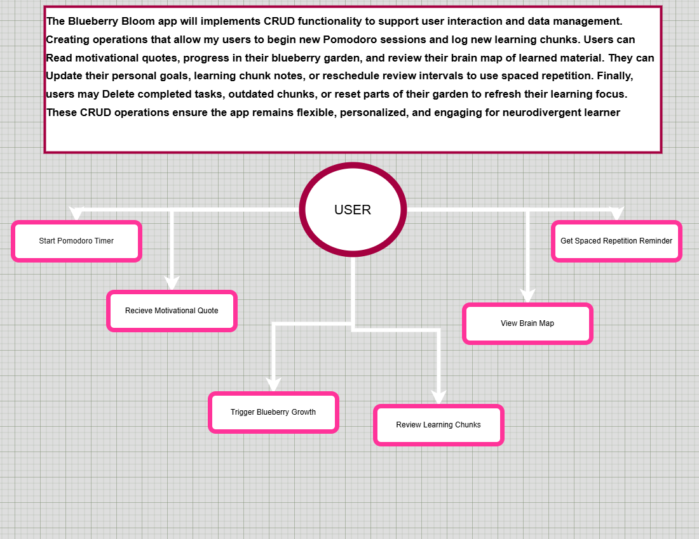
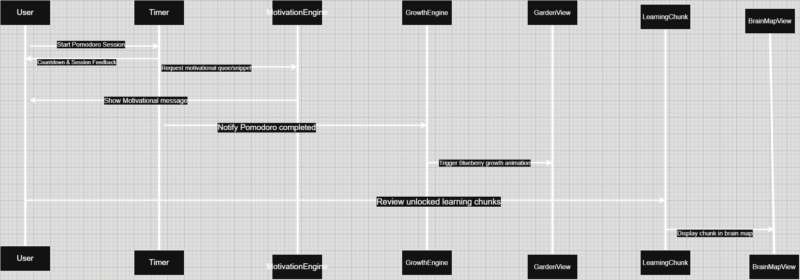
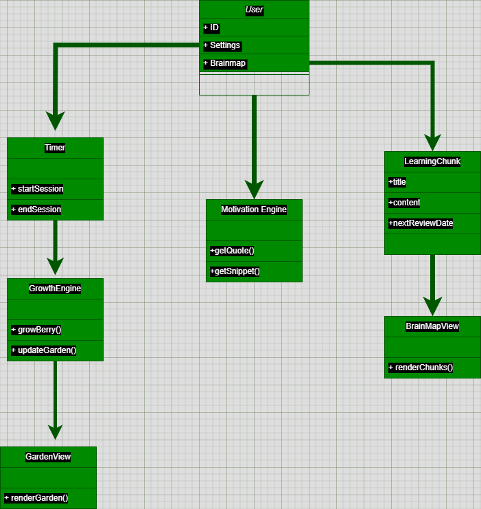

# BrightBerry Bloom 🌱

*A neurodivergence-friendly Pomodoro app for growing your learning garden.*

[](https://www.coursera.org/learn/learning-how-to-learn)
[]()
[]()

## 🌿 Overview

**Blueberry Bloom** is a productivity and learning app designed specifically for neurodivergent individuals. It integrates the [Pomodoro technique](https://en.wikipedia.org/wiki/Pomodoro_Technique) with key principles from the ["Learning How to Learn" course](https://www.coursera.org/learn/learning-how-to-learn). By transforming focused study time into a virtual garden where users grow blueberries, the app provides a visual metaphor for building stronger neural pathways. Each completed Pomodoro session rewards users with growth progress, motivational quotes, and tips based on cognitive science, such as chunking, active recall, and spaced repetition.

The app's design, inspired by plant-growing games, aims to reduce cognitive overload and increase engagement, making it particularly suitable for neurodivergent learners.

## 🎯 Purpose

This project serves multiple goals:

- **Demonstrate Learning**: Apply and showcase key cognitive strategies from the "Learning How to Learn" course.
- **Visualize Concepts**: Help users visualize and interact with abstract learning concepts through a tangible metaphor.
- **Motivational Tool**: Provide a structured and rewarding way for neurodivergent users to manage their learning and productivity.

## 🧠 Course Concepts Addressed

- **Chunking**: Users collect "blueberries" as symbols for mastering learning chunks.
- **Spaced Repetition**: Knowledge snippets are revisited over time with interactive feedback to enhance retention.
- **Focused and Diffuse Modes**: The timer cycles guide users through periods of deep focus followed by relaxation, optimizing both modes of thinking.
- **Procrastination and Habit Formation**: Integrated rewards and reminders help build consistent study habits and overcome procrastination.

## 🌱 How It’s Used in Real Life

I use **Blueberry Bloom** daily to manage my attention and structure my learning time. The visual metaphor of cultivating blueberries mirrors the effort and satisfaction of growing my understanding. It keeps me grounded, motivated, and connected to the learning process.

## ✨ Features

- 🌳 **Grow Blueberry Bushes**: Each Pomodoro cycle contributes to the growth of your virtual garden.
- 🧠 **Motivational Quotes & Tips**: Receive random quotes and learning tips that reinforce key concepts through spaced repetition.
- 🧩 **Unlockable Knowledge Chunks**: Store and visualize your learning progress in a "brain map."
- 📅 **Custom Schedule Planner**: Tailor your focus sessions to match your personal rhythms.
- 🎨 **Neurodivergent-Friendly Interface**: Designed with smooth edges and no harsh boxes to minimize cognitive strain.

---

# 📊 Diagrams

---

## 📄 🧠 **Use Case Diagram**
   

```
                +---------------------+
                |     Neurodivergent  |
                |       Learner       |
                +---------------------+
                          |
     +--------------------+-------------------+
     |                    |                   |
[Start Timer]     [View Brain Map]     [Review Tips]
     |                    |                   |
[Earn Blueberries]   [Track Learning]   [Motivation / Recall]
```

## 🔁 **Sequence Diagram**
  

```
User -> UI: Start Pomodoro
UI -> Timer: Start 25-minute focus timer
Timer -> UI: Countdown and progress feedback
Timer -> MotivationEngine: Fetch quote/snippet
MotivationEngine -> UI: Display motivational quote/snippet
Timer -> UI: Notify session complete
UI -> GrowthEngine: Add blueberry growth
GrowthEngine -> UI: Animate visual growth
```

## 🧩 **Class Diagram**
   


---

## 📝 Final Notes

This app, though conceptual in this form, illustrates the connection between behavior, attention, motivation, and learning using brain-based techniques from *Learning How to Learn*. It transforms time and learning into something you can **see grow** — one blueberry at a time.

